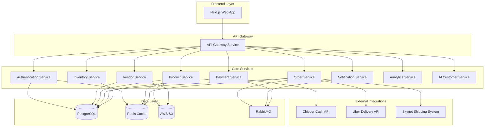

# Design Document: Seller Web Platform

## Overview

The Seller Web Platform is a high-performance web application built with Next.js (React + TypeScript) frontend and Go backend microservices architecture. The platform enables vendors to manage their online stores within a unified multivendor marketplace ecosystem. The system integrates with Chipper Cash for payments, Uber API for deliveries, and a custom Skynet shipping system for logistics coordination.

### Technology Stack

**Frontend:**
- Next.js 14+ (React 18+ with TypeScript)
- TailwindCSS for styling
- React Query for state management and API caching
- Chart.js for analytics visualization
- Next-Auth for authentication

**Backend:**
- Go 1.21+ with Gin framework for HTTP routing
- gRPC for inter-service communication
- PostgreSQL 15+ for relational data
- Redis for caching and session management
- RabbitMQ for asynchronous message processing

**Infrastructure:**
- Docker containers for deployment
- Kubernetes for orchestration
- Nginx as reverse proxy and load balancer
- AWS S3 for image storage
- CloudFront CDN for static asset delivery

## Architecture

### High-Level Architecture

The system follows a microservices architecture pattern with the following services:





### Service Responsibilities

**1. API Gateway Service**
- Routes requests to appropriate microservices
- Handles rate limiting and request throttling
- Performs request validation and sanitization
- Manages CORS and security headers
- Aggregates responses from multiple services

**2. Authentication Service**
- Manages vendor registration and login
- Issues and validates JWT tokens
- Handles password reset workflows
- Manages session state in Redis
- Enforces security policies (account lockout, password complexity)

**3. Vendor Service**
- Manages vendor profiles and store information
- Handles store settings and configuration
- Manages business hours and contact information
- Processes store logo and banner uploads
- Maintains vendor subscription status (free/premium)

**4. Product Service**
- Manages product catalog CRUD operations
- Handles product image uploads and optimization
- Manages product categories and variants
- Implements product search and filtering
- Syncs product data to buyer applications

**5. Order Service**
- Processes incoming orders from buyer applications
- Manages order lifecycle (pending, processing, shipped, delivered, cancelled)
- Coordinates with delivery and shipping integrations
- Handles order search and filtering
- Maintains order history and audit logs

**6. Payment Service**
- Integrates with Chipper Cash API for payment processing
- Calculates 3% commission on transactions
- Manages payout requests and processing
- Handles refund workflows
- Maintains transaction history and reconciliation

**7. Inventory Service**
- Tracks product stock levels
- Handles inventory updates and adjustments
- Implements low stock alerts
- Prevents overselling through stock validation
- Manages inventory across product variants

**8. Notification Service**
- Sends notifications via email, SMS, and in-app channels
- Manages notification preferences per vendor
- Processes notification queue from RabbitMQ
- Handles notification templates and personalization
- Tracks notification delivery status

**9. Analytics Service**
- Aggregates sales data and metrics
- Generates reports and visualizations
- Calculates key performance indicators
- Handles data export functionality
- Provides real-time dashboard metrics

**10. AI Customer Service (Premium)**
- Processes customer inquiries using NLP
- Generates response suggestions for vendors
- Handles automated responses for common questions
- Maintains conversation context and history
- Learns from vendor interactions to improve responses


## Components and Interfaces

### Frontend Components

**1. Authentication Module**
```typescript
// Login Component
interface LoginProps {
  onSuccess: (token: string) => void;
  onError: (error: Error) => void;
}

// Registration Component
interface RegistrationProps {
  onSuccess: (vendorId: string) => void;
  onError: (error: Error) => void;
}

// Password Reset Component
interface PasswordResetProps {
  email: string;
  onSuccess: () => void;
}
```

**2. Dashboard Module**
```typescript
// Dashboard Overview
interface DashboardMetrics {
  totalSales: number;
  orderCount: number;
  revenue: number;
  commission: number;
  period: DateRange;
}

// Sales Chart Component
interface SalesChartProps {
  data: SalesDataPoint[];
  dateRange: DateRange;
  chartType: 'line' | 'bar';
}
```

**3. Product Management Module**
```typescript
// Product List Component
interface ProductListProps {
  products: Product[];
  onEdit: (productId: string) => void;
  onDelete: (productId: string) => void;
  onSearch: (query: string) => void;
}

// Product Form Component
interface ProductFormProps {
  product?: Product;
  onSave: (product: Product) => Promise<void>;
  onCancel: () => void;
}

// Image Upload Component
interface ImageUploadProps {
  maxFiles: number;
  maxSizeBytes: number;
  onUpload: (files: File[]) => Promise<string[]>;
}
```

**4. Order Management Module**
```typescript
// Order List Component
interface OrderListProps {
  orders: Order[];
  filters: OrderFilters;
  onFilterChange: (filters: OrderFilters) => void;
  onOrderSelect: (orderId: string) => void;
}

// Order Details Component
interface OrderDetailsProps {
  order: Order;
  onAccept: () => Promise<void>;
  onReject: (reason: string) => Promise<void>;
  onMarkReady: () => Promise<void>;
}

// Order Status Timeline
interface OrderTimelineProps {
  events: OrderEvent[];
}
```

**5. Inventory Management Module**
```typescript
// Inventory Dashboard
interface InventoryDashboardProps {
  products: ProductInventory[];
  lowStockThreshold: number;
  onUpdateStock: (productId: string, quantity: number) => Promise<void>;
}

// Stock Alert Component
interface StockAlertProps {
  alerts: StockAlert[];
  onDismiss: (alertId: string) => void;
}
```

**6. Payment & Payout Module**
```typescript
// Transaction History
interface TransactionHistoryProps {
  transactions: Transaction[];
  dateRange: DateRange;
  onExport: () => void;
}

// Payout Request Component
interface PayoutRequestProps {
  availableBalance: number;
  minimumPayout: number;
  onRequest: (amount: number) => Promise<void>;
}
```

**7. Analytics Module**
```typescript
// Analytics Dashboard
interface AnalyticsDashboardProps {
  metrics: AnalyticsMetrics;
  dateRange: DateRange;
  onDateRangeChange: (range: DateRange) => void;
}

// Report Export Component
interface ReportExportProps {
  reportType: 'sales' | 'products' | 'transactions';
  format: 'csv' | 'pdf';
  dateRange: DateRange;
  onExport: () => Promise<Blob>;
}
```


### Backend API Interfaces

**1. Authentication API**
```go
// POST /api/v1/auth/register
type RegisterRequest struct {
    Email           string `json:"email" binding:"required,email"`
    Password        string `json:"password" binding:"required,min=8"`
    StoreName       string `json:"store_name" binding:"required"`
    BusinessType    string `json:"business_type"`
    PhoneNumber     string `json:"phone_number" binding:"required"`
}

type RegisterResponse struct {
    VendorID string `json:"vendor_id"`
    Token    string `json:"token"`
}

// POST /api/v1/auth/login
type LoginRequest struct {
    Email    string `json:"email" binding:"required,email"`
    Password string `json:"password" binding:"required"`
}

type LoginResponse struct {
    Token        string `json:"token"`
    RefreshToken string `json:"refresh_token"`
    VendorID     string `json:"vendor_id"`
    ExpiresIn    int64  `json:"expires_in"`
}

// POST /api/v1/auth/reset-password
type PasswordResetRequest struct {
    Email string `json:"email" binding:"required,email"`
}
```

**2. Vendor API**
```go
// GET /api/v1/vendors/{vendorId}
type VendorProfile struct {
    VendorID        string    `json:"vendor_id"`
    StoreName       string    `json:"store_name"`
    Description     string    `json:"description"`
    LogoURL         string    `json:"logo_url"`
    BannerURL       string    `json:"banner_url"`
    ContactEmail    string    `json:"contact_email"`
    PhoneNumber     string    `json:"phone_number"`
    BusinessHours   []Hours   `json:"business_hours"`
    SubscriptionTier string   `json:"subscription_tier"`
    CreatedAt       time.Time `json:"created_at"`
}

// PUT /api/v1/vendors/{vendorId}
type UpdateVendorRequest struct {
    StoreName     string  `json:"store_name"`
    Description   string  `json:"description"`
    ContactEmail  string  `json:"contact_email"`
    PhoneNumber   string  `json:"phone_number"`
    BusinessHours []Hours `json:"business_hours"`
}

// POST /api/v1/vendors/{vendorId}/upload-logo
type UploadImageResponse struct {
    ImageURL string `json:"image_url"`
}
```

**3. Product API**
```go
// POST /api/v1/products
type CreateProductRequest struct {
    VendorID    string          `json:"vendor_id" binding:"required"`
    Name        string          `json:"name" binding:"required"`
    Description string          `json:"description"`
    Price       float64         `json:"price" binding:"required,gt=0"`
    Currency    string          `json:"currency" binding:"required"`
    CategoryID  string          `json:"category_id"`
    Images      []string        `json:"images"`
    Variants    []ProductVariant `json:"variants"`
    SKU         string          `json:"sku"`
}

type Product struct {
    ProductID   string          `json:"product_id"`
    VendorID    string          `json:"vendor_id"`
    Name        string          `json:"name"`
    Description string          `json:"description"`
    Price       float64         `json:"price"`
    Currency    string          `json:"currency"`
    CategoryID  string          `json:"category_id"`
    Images      []string        `json:"images"`
    Variants    []ProductVariant `json:"variants"`
    SKU         string          `json:"sku"`
    Status      string          `json:"status"`
    CreatedAt   time.Time       `json:"created_at"`
    UpdatedAt   time.Time       `json:"updated_at"`
}

// GET /api/v1/products?vendorId={vendorId}&page={page}&limit={limit}
type ProductListResponse struct {
    Products   []Product `json:"products"`
    TotalCount int       `json:"total_count"`
    Page       int       `json:"page"`
    Limit      int       `json:"limit"`
}

// PUT /api/v1/products/{productId}
// DELETE /api/v1/products/{productId}
```

**4. Order API**
```go
// GET /api/v1/orders?vendorId={vendorId}&status={status}
type Order struct {
    OrderID         string      `json:"order_id"`
    VendorID        string      `json:"vendor_id"`
    BuyerID         string      `json:"buyer_id"`
    Items           []OrderItem `json:"items"`
    TotalAmount     float64     `json:"total_amount"`
    Currency        string      `json:"currency"`
    Status          string      `json:"status"`
    DeliveryAddress Address     `json:"delivery_address"`
    CreatedAt       time.Time   `json:"created_at"`
    UpdatedAt       time.Time   `json:"updated_at"`
}

type OrderItem struct {
    ProductID   string  `json:"product_id"`
    ProductName string  `json:"product_name"`
    Quantity    int     `json:"quantity"`
    Price       float64 `json:"price"`
    VariantID   string  `json:"variant_id,omitempty"`
}

// PUT /api/v1/orders/{orderId}/accept
type AcceptOrderRequest struct {
    EstimatedPrepTime int `json:"estimated_prep_time"` // minutes
}

// PUT /api/v1/orders/{orderId}/reject
type RejectOrderRequest struct {
    Reason string `json:"reason" binding:"required"`
}

// PUT /api/v1/orders/{orderId}/ready
type MarkReadyRequest struct {
    PickupAddress Address `json:"pickup_address" binding:"required"`
}
```

**5. Payment API**
```go
// GET /api/v1/payments/transactions?vendorId={vendorId}
type Transaction struct {
    TransactionID string    `json:"transaction_id"`
    OrderID       string    `json:"order_id"`
    VendorID      string    `json:"vendor_id"`
    GrossAmount   float64   `json:"gross_amount"`
    Commission    float64   `json:"commission"`
    NetAmount     float64   `json:"net_amount"`
    Currency      string    `json:"currency"`
    Status        string    `json:"status"`
    ProcessedAt   time.Time `json:"processed_at"`
}

// POST /api/v1/payments/payout
type PayoutRequest struct {
    VendorID string  `json:"vendor_id" binding:"required"`
    Amount   float64 `json:"amount" binding:"required,gt=0"`
}

type PayoutResponse struct {
    PayoutID      string    `json:"payout_id"`
    Amount        float64   `json:"amount"`
    Status        string    `json:"status"`
    EstimatedDate time.Time `json:"estimated_date"`
}
```

**6. Inventory API**
```go
// GET /api/v1/inventory?vendorId={vendorId}
type InventoryItem struct {
    ProductID     string    `json:"product_id"`
    ProductName   string    `json:"product_name"`
    VariantID     string    `json:"variant_id,omitempty"`
    Quantity      int       `json:"quantity"`
    LowStockAlert bool      `json:"low_stock_alert"`
    Threshold     int       `json:"threshold"`
    UpdatedAt     time.Time `json:"updated_at"`
}

// PUT /api/v1/inventory/{productId}
type UpdateInventoryRequest struct {
    Quantity  int    `json:"quantity" binding:"required,gte=0"`
    VariantID string `json:"variant_id,omitempty"`
}
```

**7. Analytics API**
```go
// GET /api/v1/analytics/dashboard?vendorId={vendorId}&period={period}
type DashboardMetrics struct {
    TotalSales     float64 `json:"total_sales"`
    OrderCount     int     `json:"order_count"`
    Revenue        float64 `json:"revenue"`
    Commission     float64 `json:"commission"`
    NetEarnings    float64 `json:"net_earnings"`
    Period         string  `json:"period"`
    TopProducts    []TopProduct `json:"top_products"`
    SalesTrend     []DataPoint  `json:"sales_trend"`
}

// GET /api/v1/analytics/export?vendorId={vendorId}&type={type}&format={format}
type ExportRequest struct {
    VendorID  string `query:"vendorId" binding:"required"`
    Type      string `query:"type" binding:"required,oneof=sales products transactions"`
    Format    string `query:"format" binding:"required,oneof=csv pdf"`
    StartDate string `query:"startDate"`
    EndDate   string `query:"endDate"`
}
```


## Data Models

### Database Schema

**1. Vendors Table**
```sql
CREATE TABLE vendors (
    vendor_id UUID PRIMARY KEY DEFAULT gen_random_uuid(),
    email VARCHAR(255) UNIQUE NOT NULL,
    password_hash VARCHAR(255) NOT NULL,
    store_name VARCHAR(255) NOT NULL,
    description TEXT,
    logo_url VARCHAR(500),
    banner_url VARCHAR(500),
    contact_email VARCHAR(255),
    phone_number VARCHAR(50),
    business_type VARCHAR(100),
    subscription_tier VARCHAR(50) DEFAULT 'free',
    status VARCHAR(50) DEFAULT 'active',
    created_at TIMESTAMP DEFAULT CURRENT_TIMESTAMP,
    updated_at TIMESTAMP DEFAULT CURRENT_TIMESTAMP,
    last_login_at TIMESTAMP
);

CREATE INDEX idx_vendors_email ON vendors(email);
CREATE INDEX idx_vendors_status ON vendors(status);
```

**2. Business Hours Table**
```sql
CREATE TABLE business_hours (
    id UUID PRIMARY KEY DEFAULT gen_random_uuid(),
    vendor_id UUID REFERENCES vendors(vendor_id) ON DELETE CASCADE,
    day_of_week INT NOT NULL CHECK (day_of_week BETWEEN 0 AND 6),
    open_time TIME NOT NULL,
    close_time TIME NOT NULL,
    is_closed BOOLEAN DEFAULT false,
    created_at TIMESTAMP DEFAULT CURRENT_TIMESTAMP
);

CREATE INDEX idx_business_hours_vendor ON business_hours(vendor_id);
```

**3. Products Table**
```sql
CREATE TABLE products (
    product_id UUID PRIMARY KEY DEFAULT gen_random_uuid(),
    vendor_id UUID REFERENCES vendors(vendor_id) ON DELETE CASCADE,
    name VARCHAR(255) NOT NULL,
    description TEXT,
    price DECIMAL(10, 2) NOT NULL CHECK (price >= 0),
    currency VARCHAR(3) DEFAULT 'USD',
    category_id UUID REFERENCES categories(category_id),
    sku VARCHAR(100),
    status VARCHAR(50) DEFAULT 'active',
    created_at TIMESTAMP DEFAULT CURRENT_TIMESTAMP,
    updated_at TIMESTAMP DEFAULT CURRENT_TIMESTAMP
);

CREATE INDEX idx_products_vendor ON products(vendor_id);
CREATE INDEX idx_products_category ON products(category_id);
CREATE INDEX idx_products_status ON products(status);
CREATE INDEX idx_products_sku ON products(sku);
```

**4. Product Images Table**
```sql
CREATE TABLE product_images (
    image_id UUID PRIMARY KEY DEFAULT gen_random_uuid(),
    product_id UUID REFERENCES products(product_id) ON DELETE CASCADE,
    image_url VARCHAR(500) NOT NULL,
    display_order INT DEFAULT 0,
    created_at TIMESTAMP DEFAULT CURRENT_TIMESTAMP
);

CREATE INDEX idx_product_images_product ON product_images(product_id);
```

**5. Product Variants Table**
```sql
CREATE TABLE product_variants (
    variant_id UUID PRIMARY KEY DEFAULT gen_random_uuid(),
    product_id UUID REFERENCES products(product_id) ON DELETE CASCADE,
    name VARCHAR(255) NOT NULL,
    sku VARCHAR(100),
    price_adjustment DECIMAL(10, 2) DEFAULT 0,
    created_at TIMESTAMP DEFAULT CURRENT_TIMESTAMP
);

CREATE INDEX idx_product_variants_product ON product_variants(product_id);
```

**6. Categories Table**
```sql
CREATE TABLE categories (
    category_id UUID PRIMARY KEY DEFAULT gen_random_uuid(),
    name VARCHAR(255) NOT NULL,
    parent_category_id UUID REFERENCES categories(category_id),
    description TEXT,
    created_at TIMESTAMP DEFAULT CURRENT_TIMESTAMP
);

CREATE INDEX idx_categories_parent ON categories(parent_category_id);
```

**7. Inventory Table**
```sql
CREATE TABLE inventory (
    inventory_id UUID PRIMARY KEY DEFAULT gen_random_uuid(),
    product_id UUID REFERENCES products(product_id) ON DELETE CASCADE,
    variant_id UUID REFERENCES product_variants(variant_id) ON DELETE CASCADE,
    quantity INT NOT NULL DEFAULT 0 CHECK (quantity >= 0),
    low_stock_threshold INT DEFAULT 10,
    track_inventory BOOLEAN DEFAULT true,
    updated_at TIMESTAMP DEFAULT CURRENT_TIMESTAMP
);

CREATE INDEX idx_inventory_product ON inventory(product_id);
CREATE INDEX idx_inventory_variant ON inventory(variant_id);
CREATE UNIQUE INDEX idx_inventory_product_variant ON inventory(product_id, variant_id);
```

**8. Orders Table**
```sql
CREATE TABLE orders (
    order_id UUID PRIMARY KEY DEFAULT gen_random_uuid(),
    vendor_id UUID REFERENCES vendors(vendor_id),
    buyer_id UUID NOT NULL,
    total_amount DECIMAL(10, 2) NOT NULL,
    currency VARCHAR(3) DEFAULT 'USD',
    status VARCHAR(50) DEFAULT 'pending',
    delivery_address_id UUID REFERENCES addresses(address_id),
    estimated_prep_time INT,
    created_at TIMESTAMP DEFAULT CURRENT_TIMESTAMP,
    updated_at TIMESTAMP DEFAULT CURRENT_TIMESTAMP
);

CREATE INDEX idx_orders_vendor ON orders(vendor_id);
CREATE INDEX idx_orders_buyer ON orders(buyer_id);
CREATE INDEX idx_orders_status ON orders(status);
CREATE INDEX idx_orders_created ON orders(created_at);
```

**9. Order Items Table**
```sql
CREATE TABLE order_items (
    order_item_id UUID PRIMARY KEY DEFAULT gen_random_uuid(),
    order_id UUID REFERENCES orders(order_id) ON DELETE CASCADE,
    product_id UUID REFERENCES products(product_id),
    variant_id UUID REFERENCES product_variants(variant_id),
    product_name VARCHAR(255) NOT NULL,
    quantity INT NOT NULL CHECK (quantity > 0),
    unit_price DECIMAL(10, 2) NOT NULL,
    total_price DECIMAL(10, 2) NOT NULL,
    created_at TIMESTAMP DEFAULT CURRENT_TIMESTAMP
);

CREATE INDEX idx_order_items_order ON order_items(order_id);
CREATE INDEX idx_order_items_product ON order_items(product_id);
```

**10. Order Events Table**
```sql
CREATE TABLE order_events (
    event_id UUID PRIMARY KEY DEFAULT gen_random_uuid(),
    order_id UUID REFERENCES orders(order_id) ON DELETE CASCADE,
    event_type VARCHAR(50) NOT NULL,
    description TEXT,
    metadata JSONB,
    created_at TIMESTAMP DEFAULT CURRENT_TIMESTAMP
);

CREATE INDEX idx_order_events_order ON order_events(order_id);
CREATE INDEX idx_order_events_type ON order_events(event_type);
```

**11. Addresses Table**
```sql
CREATE TABLE addresses (
    address_id UUID PRIMARY KEY DEFAULT gen_random_uuid(),
    street_address VARCHAR(255) NOT NULL,
    city VARCHAR(100) NOT NULL,
    state VARCHAR(100),
    postal_code VARCHAR(20),
    country VARCHAR(100) NOT NULL,
    latitude DECIMAL(10, 8),
    longitude DECIMAL(11, 8),
    created_at TIMESTAMP DEFAULT CURRENT_TIMESTAMP
);
```

**12. Transactions Table**
```sql
CREATE TABLE transactions (
    transaction_id UUID PRIMARY KEY DEFAULT gen_random_uuid(),
    order_id UUID REFERENCES orders(order_id),
    vendor_id UUID REFERENCES vendors(vendor_id),
    gross_amount DECIMAL(10, 2) NOT NULL,
    commission_rate DECIMAL(5, 4) DEFAULT 0.03,
    commission_amount DECIMAL(10, 2) NOT NULL,
    net_amount DECIMAL(10, 2) NOT NULL,
    currency VARCHAR(3) DEFAULT 'USD',
    payment_provider VARCHAR(50) DEFAULT 'chipper_cash',
    payment_provider_transaction_id VARCHAR(255),
    status VARCHAR(50) DEFAULT 'pending',
    processed_at TIMESTAMP,
    created_at TIMESTAMP DEFAULT CURRENT_TIMESTAMP
);

CREATE INDEX idx_transactions_order ON transactions(order_id);
CREATE INDEX idx_transactions_vendor ON transactions(vendor_id);
CREATE INDEX idx_transactions_status ON transactions(status);
CREATE INDEX idx_transactions_processed ON transactions(processed_at);
```

**13. Payouts Table**
```sql
CREATE TABLE payouts (
    payout_id UUID PRIMARY KEY DEFAULT gen_random_uuid(),
    vendor_id UUID REFERENCES vendors(vendor_id),
    amount DECIMAL(10, 2) NOT NULL,
    currency VARCHAR(3) DEFAULT 'USD',
    status VARCHAR(50) DEFAULT 'pending',
    requested_at TIMESTAMP DEFAULT CURRENT_TIMESTAMP,
    processed_at TIMESTAMP,
    payment_method VARCHAR(50),
    payment_reference VARCHAR(255),
    created_at TIMESTAMP DEFAULT CURRENT_TIMESTAMP
);

CREATE INDEX idx_payouts_vendor ON payouts(vendor_id);
CREATE INDEX idx_payouts_status ON payouts(status);
```

**14. Deliveries Table**
```sql
CREATE TABLE deliveries (
    delivery_id UUID PRIMARY KEY DEFAULT gen_random_uuid(),
    order_id UUID REFERENCES orders(order_id),
    delivery_provider VARCHAR(50) DEFAULT 'uber',
    delivery_provider_id VARCHAR(255),
    pickup_address_id UUID REFERENCES addresses(address_id),
    dropoff_address_id UUID REFERENCES addresses(address_id),
    status VARCHAR(50) DEFAULT 'pending',
    estimated_pickup_time TIMESTAMP,
    actual_pickup_time TIMESTAMP,
    estimated_delivery_time TIMESTAMP,
    actual_delivery_time TIMESTAMP,
    tracking_url VARCHAR(500),
    created_at TIMESTAMP DEFAULT CURRENT_TIMESTAMP,
    updated_at TIMESTAMP DEFAULT CURRENT_TIMESTAMP
);

CREATE INDEX idx_deliveries_order ON deliveries(order_id);
CREATE INDEX idx_deliveries_status ON deliveries(status);
```

**15. Shipments Table**
```sql
CREATE TABLE shipments (
    shipment_id UUID PRIMARY KEY DEFAULT gen_random_uuid(),
    order_id UUID REFERENCES orders(order_id),
    shipping_provider VARCHAR(50) DEFAULT 'skynet',
    tracking_number VARCHAR(255),
    shipping_label_url VARCHAR(500),
    status VARCHAR(50) DEFAULT 'pending',
    shipped_at TIMESTAMP,
    delivered_at TIMESTAMP,
    created_at TIMESTAMP DEFAULT CURRENT_TIMESTAMP,
    updated_at TIMESTAMP DEFAULT CURRENT_TIMESTAMP
);

CREATE INDEX idx_shipments_order ON shipments(order_id);
CREATE INDEX idx_shipments_tracking ON shipments(tracking_number);
```

**16. Notifications Table**
```sql
CREATE TABLE notifications (
    notification_id UUID PRIMARY KEY DEFAULT gen_random_uuid(),
    vendor_id UUID REFERENCES vendors(vendor_id),
    type VARCHAR(50) NOT NULL,
    title VARCHAR(255) NOT NULL,
    message TEXT NOT NULL,
    channel VARCHAR(50) NOT NULL,
    status VARCHAR(50) DEFAULT 'pending',
    read_at TIMESTAMP,
    sent_at TIMESTAMP,
    created_at TIMESTAMP DEFAULT CURRENT_TIMESTAMP
);

CREATE INDEX idx_notifications_vendor ON notifications(vendor_id);
CREATE INDEX idx_notifications_status ON notifications(status);
CREATE INDEX idx_notifications_created ON notifications(created_at);
```


## Correctness Properties

*A property is a characteristic or behavior that should hold true across all valid executions of a system-essentially, a formal statement about what the system should do. Properties serve as the bridge between human-readable specifications and machine-verifiable correctness guarantees.*

### Authentication and Onboarding Properties

**Property 1: Unique vendor account creation**
*For any* valid registration data, creating a vendor account should result in a unique vendor ID and credentials that can be used for authentication.
**Validates: Requirements 1.1**

**Property 2: Valid credential authentication**
*For any* vendor account with stored credentials, attempting login with matching credentials should grant access and return a valid authentication token.
**Validates: Requirements 1.2**

**Property 3: Invalid credential rejection**
*For any* login attempt with credentials that do not match stored credentials, the system should reject authentication and return an error.
**Validates: Requirements 1.3**

**Property 4: Onboarding activation**
*For any* vendor account in onboarding state, completing all required onboarding steps should transition the account to active status and enable store management features.
**Validates: Requirements 1.4**

**Property 5: Password reset token generation**
*For any* registered vendor email, requesting password reset should generate a unique, time-limited reset token and trigger email notification.
**Validates: Requirements 1.5**

### Store Profile Properties

**Property 6: Store information persistence**
*For any* vendor store profile update, saving changes should persist the data such that subsequent retrieval returns the updated information.
**Validates: Requirements 2.1**

**Property 7: Image validation**
*For any* uploaded file, the system should validate format and size constraints before accepting the upload, rejecting files that don't meet requirements.
**Validates: Requirements 2.2**

**Property 8: Business hours availability calculation**
*For any* configured business hours and current timestamp, the system should correctly calculate whether the store is currently open or closed.
**Validates: Requirements 2.3**

**Property 9: Contact information format validation**
*For any* email address or phone number input, the system should validate the format according to standard patterns, accepting valid formats and rejecting invalid ones.
**Validates: Requirements 2.4**

**Property 10: Settings persistence across sessions**
*For any* vendor store settings, saving configuration and then starting a new session should retrieve the same settings without loss.
**Validates: Requirements 2.5**

### Product Catalog Properties

**Property 11: Product creation with validation**
*For any* product data with all required fields, creating the product should add it to the catalog with a unique product ID.
**Validates: Requirements 3.1**

**Property 12: Image optimization**
*For any* valid product image upload, the system should process and optimize the image, storing both web and mobile-optimized versions.
**Validates: Requirements 3.2**

**Property 13: Price positivity validation**
*For any* product price input, the system should accept only positive numerical values, rejecting zero, negative, or non-numeric values.
**Validates: Requirements 3.3**

**Property 14: Category hierarchy maintenance**
*For any* product assigned to a category, the system should maintain the category association and preserve the category hierarchy relationships.
**Validates: Requirements 3.4**

**Property 15: Product update synchronization**
*For any* product information update, the changes should be immediately reflected in all systems including the buyer application.
**Validates: Requirements 3.5**

**Property 16: Soft delete preservation**
*For any* product deletion, the product should be removed from active listings while all historical order data referencing that product remains intact.
**Validates: Requirements 3.6**

**Property 17: Variant inventory isolation**
*For any* product with multiple variants, inventory changes to one variant should not affect the inventory count of other variants.
**Validates: Requirements 3.7**

### Inventory Management Properties

**Property 18: Inventory initialization**
*For any* product with inventory tracking enabled, setting an initial stock quantity should record that exact quantity in the inventory system.
**Validates: Requirements 4.1**

**Property 19: Order inventory decrement**
*For any* completed order, the inventory quantity should decrease by exactly the ordered quantity for each product.
**Validates: Requirements 4.2**

**Property 20: Non-negative inventory validation**
*For any* inventory update attempt, the system should accept only non-negative integer values, rejecting negative or non-integer inputs.
**Validates: Requirements 4.4**

**Property 21: Low stock alert triggering**
*For any* product with inventory falling below its defined threshold, the system should send a low stock alert notification to the vendor.
**Validates: Requirements 4.5**

**Property 22: Overselling prevention**
*For any* product with inventory tracking enabled, order attempts exceeding available stock should be rejected.
**Validates: Requirements 4.6**

### Order Management Properties

**Property 23: Order creation with pending status**
*For any* new order from a buyer, the order should appear in the vendor dashboard with pending status and include all order details.
**Validates: Requirements 5.1**

**Property 24: Order detail completeness**
*For any* order, viewing order details should display customer information, all ordered items with quantities and prices, and delivery address.
**Validates: Requirements 5.2**

**Property 25: Order acceptance workflow**
*For any* pending order, accepting the order should update status to processing and trigger buyer notification.
**Validates: Requirements 5.3**

**Property 26: Order rejection with refund**
*For any* order rejection, the system should update status to cancelled and initiate refund processing through Chipper Cash.
**Validates: Requirements 5.4**

**Property 27: Delivery coordination trigger**
*For any* order marked as ready for delivery, the system should send a delivery request to Uber API with correct pickup and dropoff details.
**Validates: Requirements 5.5**

**Property 28: Order search filtering**
*For any* order search query with filters (order number, customer name, date range, status), the results should include only orders matching all specified criteria.
**Validates: Requirements 5.6**

**Property 29: Order event logging**
*For any* order status change, the system should create an event log entry with timestamp and status update details.
**Validates: Requirements 5.7**

### Payment and Commission Properties

**Property 30: Commission calculation accuracy**
*For any* transaction amount, the calculated commission should be exactly 3% of the gross amount, and net earnings should equal gross minus commission.
**Validates: Requirements 6.1**

**Property 31: Transaction display completeness**
*For any* processed transaction, the vendor view should display gross amount, commission deduction, and net earnings.
**Validates: Requirements 6.2**

**Property 32: Payment history completeness**
*For any* vendor, the payment history should include all transactions associated with that vendor, each with date, amounts, and commission breakdown.
**Validates: Requirements 6.3**

**Property 33: Payout calculation**
*For any* payout processing, the transferred amount should equal the sum of net earnings from all included transactions.
**Validates: Requirements 6.4**

**Property 34: Refund commission reversal**
*For any* refund issued, the vendor earnings should be adjusted by reversing the commission calculation from the original transaction.
**Validates: Requirements 6.5**

**Property 35: Payout validation**
*For any* payout request, the system should validate that the requested amount does not exceed available balance and meets minimum threshold requirements.
**Validates: Requirements 6.6**

### Delivery and Shipping Properties

**Property 36: Delivery request data completeness**
*For any* order ready for delivery, the Uber API request should include all required pickup and dropoff details.
**Validates: Requirements 7.1**

**Property 37: Pickup confirmation workflow**
*For any* delivery pickup confirmation from Uber, the order status should update to in transit and trigger buyer notification.
**Validates: Requirements 7.2**

**Property 38: Shipping label generation**
*For any* shipping method selection, the Skynet integration should generate a shipping label and tracking number.
**Validates: Requirements 7.3**

**Property 39: Delivery completion recording**
*For any* completed delivery, the order status should update to delivered and the delivery timestamp should be recorded.
**Validates: Requirements 7.4**

**Property 40: Delivery failure handling**
*For any* failed delivery, the system should notify the vendor and provide options to reschedule or cancel.
**Validates: Requirements 7.5**

**Property 41: Shipment tracking display**
*For any* shipment with tracking number, querying tracking should return current status from Skynet system.
**Validates: Requirements 7.6**

### Analytics and Reporting Properties

**Property 42: Dashboard metrics calculation**
*For any* time period, dashboard metrics (total sales, order count, revenue) should equal the sum of all transactions within that period.
**Validates: Requirements 8.1**

**Property 43: Sales trend generation**
*For any* date range, the sales report should generate chart data showing sales aggregated by time intervals within that range.
**Validates: Requirements 8.2**

**Property 44: Product performance ranking**
*For any* set of products, the top-selling products list should be ordered by total revenue in descending order.
**Validates: Requirements 8.3**

**Property 45: Report export format**
*For any* report export request, the generated file should match the requested format (CSV or PDF) and contain all relevant data.
**Validates: Requirements 8.4**

**Property 46: Date range filtering**
*For any* selected date range, all analytics data should include only transactions with timestamps within that range.
**Validates: Requirements 8.5**

**Property 47: Commission display in analytics**
*For any* analytics period, the displayed commission should equal 3% of total sales for that period.
**Validates: Requirements 8.6**

### Notification Properties

**Property 48: Immediate order notification**
*For any* new order creation, a notification should be sent to the vendor immediately (within seconds).
**Validates: Requirements 9.1**

**Property 49: Low stock alert delivery**
*For any* inventory reaching its low stock threshold, an alert notification should be sent to the vendor.
**Validates: Requirements 9.2**

**Property 50: Payout notification with details**
*For any* processed payout, a notification should be sent to the vendor including transaction details.
**Validates: Requirements 9.3**

**Property 51: Message notification delivery**
*For any* buyer message to vendor, a notification should be sent including the message preview.
**Validates: Requirements 9.4**

**Property 52: Notification channel preference**
*For any* vendor with configured notification preferences, notifications should be delivered only through the selected channels (email, SMS, in-app).
**Validates: Requirements 9.5**

**Property 53: Delivery status notification**
*For any* delivery status change, a notification should be sent to the vendor with the updated status.
**Validates: Requirements 9.6**

### Premium Features Properties

**Property 54: Premium feature activation**
*For any* vendor subscribing to premium tier, AI customer service features should become immediately available in their account.
**Validates: Requirements 10.1**

**Property 55: AI response suggestion generation**
*For any* buyer message to premium vendor, the system should provide AI-generated response suggestions.
**Validates: Requirements 10.2**

**Property 56: Automated response handling**
*For any* premium vendor with automation enabled, common customer inquiries should receive AI-generated responses automatically.
**Validates: Requirements 10.3**

**Property 57: AI conversation context maintenance**
*For any* multi-turn conversation, the AI should maintain context from previous messages when generating responses.
**Validates: Requirements 10.4**

**Property 58: Premium feature access**
*For any* vendor with premium subscription, the account should have access to priority support and advanced analytics features not available to free tier.
**Validates: Requirements 10.5**

### Multi-Currency Properties

**Property 59: Currency display consistency**
*For any* vendor with selected base currency, all prices and transactions should be displayed in that currency throughout the platform.
**Validates: Requirements 11.1**

**Property 60: Payment currency conversion**
*For any* payment in a currency different from vendor base currency, the system should convert and display the amount in vendor base currency using current exchange rates.
**Validates: Requirements 11.2**

**Property 61: Multi-language product support**
*For any* product with descriptions in multiple languages, the system should store and retrieve each language version independently.
**Validates: Requirements 11.3**

**Property 62: Buyer currency display**
*For any* buyer viewing products, prices should be displayed in the buyer's local currency with real-time conversion from vendor currency.
**Validates: Requirements 11.4**

**Property 63: Commission calculation with conversion**
*For any* multi-currency transaction, the 3% commission should be calculated after currency conversion to vendor base currency.
**Validates: Requirements 11.5**

### Security Properties

**Property 64: Data encryption at rest**
*For any* sensitive vendor data stored in the database, the data should be encrypted and not readable in plain text.
**Validates: Requirements 12.2**

**Property 65: Session timeout enforcement**
*For any* vendor session inactive for 30 minutes, the system should automatically invalidate the session and require re-authentication.
**Validates: Requirements 12.3**

**Property 66: Suspicious activity response**
*For any* detected suspicious activity pattern, the system should temporarily lock the affected account and send notification to the vendor.
**Validates: Requirements 12.4**

**Property 67: Data export completeness**
*For any* vendor data export request, the exported data should include all vendor-related information from all system tables.
**Validates: Requirements 12.5**

**Property 68: Payment card data exclusion**
*For any* payment processed through Chipper Cash, the system should not store complete card numbers in the database.
**Validates: Requirements 12.6**

### Mobile and API Properties

**Property 69: API functionality parity**
*For any* API endpoint, the functionality should be identical regardless of whether the request comes from desktop or mobile client.
**Validates: Requirements 14.2**

### Integration Resilience Properties

**Property 70: Payment retry with backoff**
*For any* Chipper Cash API failure, the system should queue the payment request and retry with exponentially increasing delays.
**Validates: Requirements 15.1**

**Property 71: Delivery integration fallback**
*For any* Uber API failure, the system should notify the vendor and provide manual delivery coordination options.
**Validates: Requirements 15.2**

**Property 72: Shipping data caching and sync**
*For any* Skynet API unavailability, the system should cache shipping data locally and synchronize when connection is restored.
**Validates: Requirements 15.3**

**Property 73: API timeout graceful handling**
*For any* external API call timeout, the system should fail gracefully and return informative error messages without crashing.
**Validates: Requirements 15.4**

**Property 74: Integration error logging**
*For any* integration error with external APIs, the system should log detailed error information including request/response data and timestamps.
**Validates: Requirements 15.5**


## Error Handling

### Error Categories

**1. Validation Errors (4xx)**
- Invalid input data (malformed requests, missing required fields)
- Business rule violations (negative prices, insufficient inventory)
- Authentication failures (invalid credentials, expired tokens)
- Authorization failures (insufficient permissions)

**2. Integration Errors (5xx)**
- External API failures (Chipper Cash, Uber, Skynet unavailable)
- Timeout errors (slow external service responses)
- Rate limiting (too many requests to external services)

**3. System Errors (5xx)**
- Database connection failures
- Internal server errors
- Resource exhaustion (memory, disk space)

### Error Response Format

All API errors follow a consistent JSON structure:

```json
{
  "error": {
    "code": "ERROR_CODE",
    "message": "Human-readable error message",
    "details": {
      "field": "specific_field",
      "reason": "detailed explanation"
    },
    "timestamp": "2024-01-15T10:30:00Z",
    "request_id": "uuid"
  }
}
```

### Error Handling Strategies

**1. Retry Logic**
- Implement exponential backoff for transient failures
- Maximum 3 retry attempts for external API calls
- Queue critical operations (payments, notifications) for later retry

**2. Circuit Breaker Pattern**
- Monitor external service health
- Open circuit after 5 consecutive failures
- Half-open state after 30 seconds to test recovery
- Close circuit after 2 successful requests

**3. Graceful Degradation**
- Cache frequently accessed data (product catalogs, vendor profiles)
- Serve cached data when external services are unavailable
- Provide manual fallback options for critical workflows

**4. Error Logging and Monitoring**
- Log all errors with context (user ID, request ID, timestamp)
- Alert on critical errors (payment failures, data corruption)
- Track error rates and patterns for proactive monitoring

### Specific Error Scenarios

**Payment Processing Failures:**
- Queue payment for retry with exponential backoff
- Notify vendor of payment processing delay
- Provide manual payment verification option
- Maintain order in pending state until payment confirmed

**Delivery Coordination Failures:**
- Notify vendor immediately of delivery API failure
- Provide manual delivery coordination interface
- Allow vendor to input tracking information manually
- Retry delivery request automatically after cooldown period

**Inventory Synchronization Errors:**
- Lock product for ordering if inventory state is uncertain
- Reconcile inventory counts during off-peak hours
- Alert vendor of inventory discrepancies
- Provide manual inventory adjustment interface

**Authentication Errors:**
- Lock account after 5 failed login attempts
- Send security alert to vendor email
- Require password reset for account unlock
- Log all authentication attempts for security audit


## Testing Strategy

### Dual Testing Approach

The Seller Web Platform employs both unit testing and property-based testing to ensure comprehensive correctness validation. These approaches are complementary:

- **Unit tests** verify specific examples, edge cases, and error conditions
- **Property tests** verify universal properties that should hold across all inputs
- Together they provide comprehensive coverage: unit tests catch concrete bugs, property tests verify general correctness

### Property-Based Testing

**Framework Selection:**
- **Go Backend:** Use [gopter](https://github.com/leanovate/gopter) for property-based testing
- **TypeScript Frontend:** Use [fast-check](https://github.com/dubzzz/fast-check) for property-based testing

**Configuration:**
- Each property-based test MUST run a minimum of 100 iterations
- Tests should use smart generators that constrain inputs to valid ranges
- Each property test MUST be tagged with a comment referencing the design document property

**Tagging Format:**
```go
// Feature: seller-web-platform, Property 30: Commission calculation accuracy
// Validates: Requirements 6.1
func TestCommissionCalculationProperty(t *testing.T) {
    // property test implementation
}
```

**Property Test Implementation Guidelines:**

1. **Commission Calculation (Property 30)**
   - Generate random transaction amounts (0.01 to 1,000,000)
   - Verify commission = amount * 0.03
   - Verify net = amount - commission
   - Verify gross = net + commission (round-trip)

2. **Inventory Decrement (Property 19)**
   - Generate random initial inventory (1 to 10,000)
   - Generate random order quantity (1 to initial inventory)
   - Verify new inventory = initial - order quantity
   - Verify inventory never goes negative

3. **Order Search Filtering (Property 28)**
   - Generate random set of orders with various attributes
   - Generate random filter criteria
   - Verify all returned orders match ALL filter criteria
   - Verify no matching orders are excluded

4. **Password Reset Token (Property 5)**
   - Generate random vendor emails
   - Request password reset
   - Verify unique token is generated
   - Verify token has expiration time
   - Verify token can be used exactly once

5. **Product Update Synchronization (Property 15)**
   - Generate random product updates
   - Apply update to product
   - Retrieve product from all systems
   - Verify all systems return updated data

6. **Multi-Currency Conversion (Property 60)**
   - Generate random amounts in various currencies
   - Convert to vendor base currency
   - Verify conversion uses current exchange rate
   - Verify reverse conversion returns original amount (within rounding tolerance)

7. **Session Timeout (Property 65)**
   - Generate random session with last activity timestamp
   - Check session validity after 30 minutes
   - Verify session is invalidated
   - Verify new authentication is required

8. **Overselling Prevention (Property 22)**
   - Generate random inventory level
   - Attempt order exceeding inventory
   - Verify order is rejected
   - Verify inventory unchanged

### Unit Testing

**Framework Selection:**
- **Go Backend:** Use standard `testing` package with `testify` for assertions
- **TypeScript Frontend:** Use Jest with React Testing Library

**Unit Test Coverage Areas:**

1. **Authentication Module**
   - Test successful registration with valid data
   - Test registration rejection with duplicate email
   - Test login with correct credentials
   - Test login rejection with incorrect password
   - Test password reset email generation
   - Test token expiration handling

2. **Product Management**
   - Test product creation with all required fields
   - Test product creation failure with missing fields
   - Test image upload with valid formats (JPEG, PNG)
   - Test image upload rejection with invalid formats
   - Test product deletion preserves order history
   - Test variant creation and inventory tracking

3. **Order Processing**
   - Test order acceptance workflow
   - Test order rejection with refund initiation
   - Test order status transitions
   - Test order event logging
   - Test delivery coordination trigger

4. **Payment Integration**
   - Test Chipper Cash API request formatting
   - Test commission calculation for various amounts
   - Test refund processing
   - Test payout validation
   - Test transaction history retrieval

5. **Inventory Management**
   - Test inventory initialization
   - Test low stock alert triggering at threshold
   - Test inventory update validation (non-negative)
   - Test variant inventory isolation

6. **External API Integration**
   - Test Uber API request formatting
   - Test Skynet API request formatting
   - Test API error handling and retry logic
   - Test circuit breaker behavior
   - Test timeout handling

7. **Notification System**
   - Test notification creation for various events
   - Test notification channel selection based on preferences
   - Test notification queue processing
   - Test notification delivery status tracking

### Integration Testing

**Test Scenarios:**

1. **End-to-End Order Flow**
   - Create vendor account
   - Add products with inventory
   - Receive order from buyer
   - Accept order
   - Process payment through Chipper Cash (mocked)
   - Coordinate delivery through Uber (mocked)
   - Complete delivery
   - Verify commission calculation
   - Process payout

2. **Multi-Vendor Scenario**
   - Create multiple vendor accounts
   - Add products from different vendors
   - Place orders spanning multiple vendors
   - Verify order routing to correct vendors
   - Verify independent inventory tracking
   - Verify separate payment processing

3. **Error Recovery Scenarios**
   - Simulate Chipper Cash API failure during payment
   - Verify payment queuing and retry
   - Simulate Uber API failure during delivery
   - Verify fallback to manual coordination
   - Simulate database connection loss
   - Verify graceful degradation with cached data

### Test Data Management

**Test Data Generators:**
- Create factories for generating test vendors, products, orders
- Use realistic data distributions (prices, quantities, dates)
- Include edge cases (minimum/maximum values, boundary conditions)
- Generate multi-language and multi-currency test data

**Test Database:**
- Use separate test database instance
- Reset database state between test runs
- Seed with baseline data for integration tests
- Use transactions for test isolation

### Performance Testing

**Load Testing Scenarios:**
- Simulate 1,000 concurrent vendor logins
- Simulate 10,000 product catalog queries per minute
- Simulate 500 orders per minute across vendors
- Measure response times under load
- Identify bottlenecks and optimization opportunities

**Stress Testing:**
- Test system behavior at 2x expected peak load
- Test database connection pool exhaustion
- Test external API rate limiting
- Test memory usage under sustained load

### Continuous Testing

**CI/CD Pipeline:**
- Run unit tests on every commit
- Run property tests on every pull request
- Run integration tests before deployment
- Run performance tests weekly
- Generate code coverage reports (target: 80%+)

**Test Monitoring:**
- Track test execution time trends
- Alert on test failures
- Monitor flaky tests and investigate root causes
- Track property test failure rates and counterexamples

